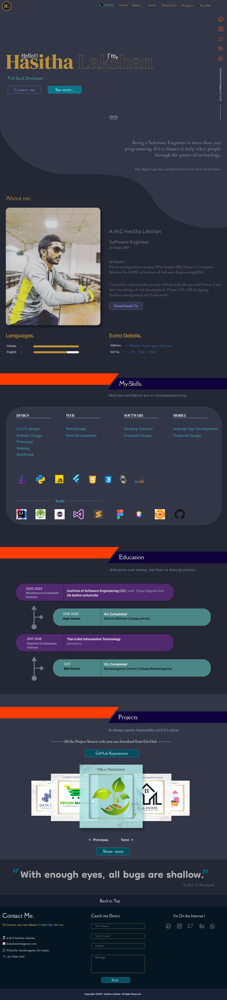
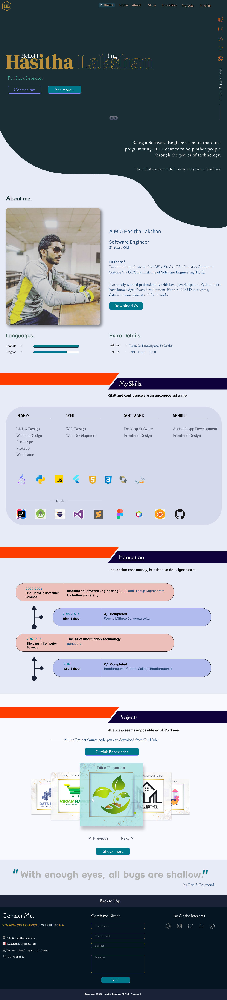

 
  

- ⚜ Moke-Up --->: [Click Here](https://www.figma.com/proto/08ioVAGFgh1Psnrb93ZGfW/Portfolio?node-id=0%3A1&scaling=min-zoom&page-id=0%3A1&starting-point-node-id=183%3A55)
- ⚜ Wireframe -->: [Click Here](https://wireframe.cc/I1Wa9g)
- ⚜ Site Map  ---->: [Click Here](https://www.gloomaps.com/976edlsGTx)

<H3>Technology Stack</H3>
<ul>
<li>HTML</li>
<li>CSS</li>
<li>Java Script</li>
</ul>

<H3>Main Assignment</H3>
<ul>
<li><a href="My-Portfolio/assignment/JS/calculaor/calculator.html" target="blank">Calculator</a></li>
<li><a href="as" target="blank">POS System</a></li>
</ul>

<H3>01. Dark Theme</H3>

<H5>Dark Theme-Project side</H5>

  
<H3>02. Light Theme</H3>

<H5>Light Theme-Project side</H5>

